# Neural Webs
An exploration of adding biologically informed behaviors to artificial 
neural networks

# Neurons
Composed of organelles that simulate biological actions, each neuron has a 
spatial position. New connections are created and old connections severed 
based on the positional data of each neuron. (closer = greater likelhood to 
connect. Further = greater likelihood to sever)

During the update process, positions are also updated based on proximity, 
connection / activation strength via the Soma, and a generalized localized 
 error (TBD).

### Organelles
- Neurons (container)
- Soma (gating incoming signals)
  - (TBD?) Somatic Attention - (learnable attention mechanism via ROPE and 
    attention)
  - OR - relying on gating in the spiking membrane to push activation signal 
over time?
- Nucleus (positional)
- Membrane (Threshold and behavior) spiking membrane - gating outgoing signals 
  and "firing" the neuron
- Dendrites - (Connections and Weights) Individual connections to other Neurons

# Visuals & Diagrams

https://mermaid.js.org/config/Tutorials.html

```mermaid
mindmap;
    Signal_X
        Neuron
            <b>Somatic Gate</b> <br> "Hardening" of receptors per entry connection 
                <b>Spiking_Membrane</b> <br> "potential energy" stored in the membrane
                    <b>Threshold</b> <br> cell-level activation if pot-energy thresh is reached
                <b>Dendritic Connections </b> <br> energy leavers through dendritic connections
                    signal_x • dendritic_W
                        --> outbound signal
        Local Error is calculated to update membranes
```
